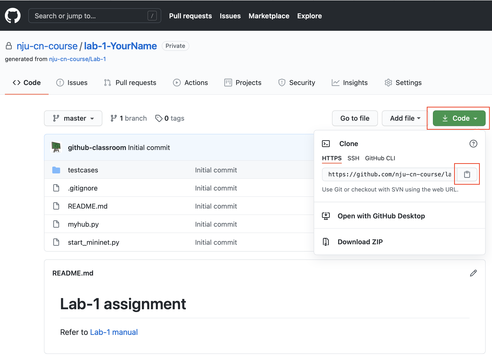

# Task 4: Modification

## Preparation

Get the Lab-1 assignment template codes:

1. Click [Lab-1](https://classroom.github.com/a/Re9pXmXp) and accept this assignment. Wait for a few seconds and refresh the page.

2. Click the URL to the repository on the page which is similar to [https://github.com/nju-cn-course/lab-1-YourName](https://github.com/nju-cn-course/lab-1-YourName).

3. Clone the repository to your local machine. 

   - Click the green “Code” button and click the icon. You will get the URL in your clipboard similar to [https://github.com/nju-cn-course/lab-1-YourName.git](https://github.com/nju-cn-course/lab-1-YourName.git).


   
- Go to a proper directory \(e.g. `~/networkLab`\) on you Ubuntu, and clone this repository by inputing the command below. Notice that the URL should be pasted from your clipboard.
   
  ```bash
     $ git clone https://github.com/nju-cn-course/lab-1-YourName.git
     ```
   
  After a few seconds, there will be a new directory int you current directory named `Lab-1-YourName`.
   
4. Edit the source codes in `Lab-1-YourName` directory following steps below.

## Play the Tutorial Again

You have done the tutorial. However it is necessary to work by yourself. So modify our examples files.


We suggest that you can commit in Git when you complete one step.


### Step 1: Modify the Mininet topology

In the section [Mininet](workflow/mininet.md), we introduced how to construct a topology. So here we have two options for you, choose **one** to implement. ✅ Then show the details of how you build the topology in your report.

* Delete `server2` in the topology,
* Or create a different topology containing 6 nodes using hosts and hubs \(don't use other kinds of devices\).

The file you need to modify is `start_mininet.py`.

### Step 2: Modify the logic of a device

In the section [Switchyard](workflow/switchyard.md), we introduced how to program a device. Your task is to count how many packets pass through a hub in and out. You need to log the statistical result every time you receive one packet with the format of each line `in:<ingress packet count> out:<egress packet count>`. For example, if there is a packet that is not addressed to the hub itself, then the hub may log `in:1 out:2`. ✅ Then show the log of your hub when running it in Mininet and how you implement it in your report.

The file you need to modify is `myhub.py`.

### Step 3: Modify the test scenario of a device

In the section [Switchyard](workflow/switchyard.md), we introduced how to write the test case. So here we have two options for you, choose **one** to implement. ✅ Then show the details of your test cases in your report.

* Create one test case by using the given function `new_packet` with different arguments,
* Or create one test case with your handmade packet.

The file you need to modify is `testcases/myhub_testscenario.py`.

### Step 4: Run your device in Mininet

In the section [Switchyard](workflow/switchyard.md), we introduced how to run Switchyard programs in Mininet. So run your new hub in your new topology and make sure it works. ✅ Show the procedure in your report.

### Step 5: Capture using Wireshark

Both in section [Wireshark](workflow/wireshark.md) and [Switchyard](workflow/switchyard.md), we introduced how to capture packets. In your own topology, capture packets on one host \(no hub\) while creating some traffic. **Save your capture file** and submit it with your report and code. ✅ Also you need to describe the details of your capture file.

