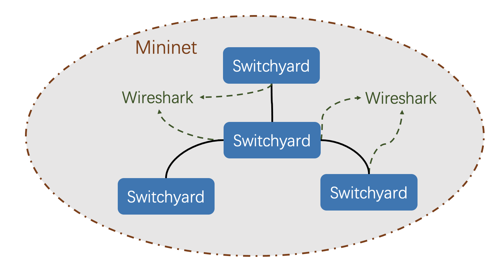

# Task 2: Workflow

Our experiment requires Mininet to build a network. You will use Switchyard to run your network device. Wireshark is used to capture packets. And you may use Visual Studio Code to develope your projects. Here are four sections to introduce them and we ask you to read these sections carefully. This will affect your later experiments.

You will see an example of the network hub, a network hardware device for connecting multiple Ethernet devices together and making them act as a single network segment. It has multiple input/output \(I/O\) ports, in which a signal introduced at the input of any port appears at the output of every port except the original incoming. A hub works at the physical layer \(layer 1\) of the OSI model. In short, hub allows devices to communicate with each other. Here you don't need to understand the working principle of hub.

* [VS Code](vscode.md)
* [Mininet](mininet.md)
* [Wireshark](wireshark.md)
* [Switchyard](switchyard.md)

