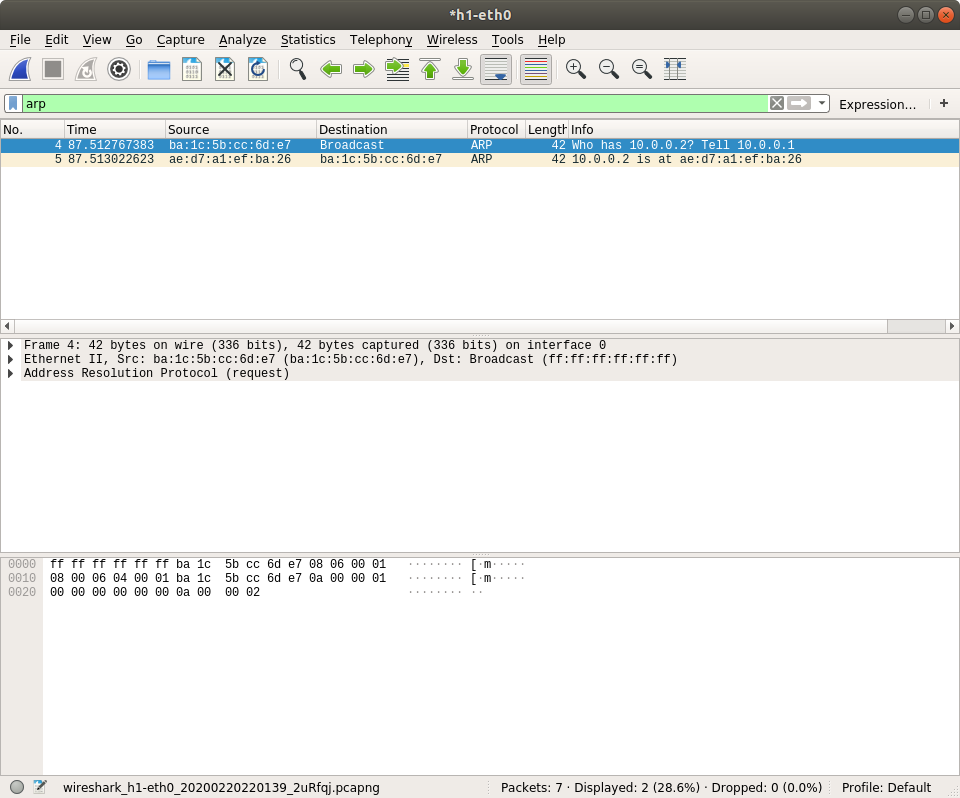

# Wireshark

Wireshark is the world’s foremost and widely-used network protocol analyzer. It lets you see what’s happening on your network at a microscopic level and is the de facto \(and often de jure\) standard across many commercial and non-profit enterprises, government agencies, and educational institutions.

You will use it to inspect your network setting up by Mininet, and test the function of your device written in Switchyard. We also have a small practice of Wireshark in our manual.

[Wireshark User’s Guide](https://www.wireshark.org/docs/wsug_html/) is a verbose document about Wireshark so that we **do NOT** recommend it. Sometimes the official document is hard for user to get started. You can find many blogs writing about how to use Wireshark. Read them instead or the first search result in Google [here](https://www.howtogeek.com/104278/how-to-use-wireshark-to-capture-filter-and-inspect-packets/).

We expect that this will cost you an afternoon.

## Install Wireshark

If you find that Wireshark is not installed on your system, run these commands to install it.

```text
$ sudo add-apt-repository ppa:wireshark-dev/stable
$ sudo apt-get update
$ sudo apt-get install wireshark
```

You need to configure wireshark during installation. For non-superusers capturing packets, choose _Yes_ here.


Then add your user to `wireshark` user group to allow you capturing packets.

```text
$ sudo usermod -a -G wireshark $USER
```

## Capturing Packets

First start the default Mininet topology.

```text
$ sudo mn
```

Then open wireshark in `h1`.

```text
mininet> h1 wireshark &
```


You need to choose which traffic you want to capture. Packets will send and receive on `h1-eth0` so you double click it.

It will be empty or some ICMPv6 packets be captured. Let's make some traffic ourselves.

```text
mininet> h1 ping -c 1 h2
```


So here we have more packets captured. You may not know why these packets show up, but you will learned in the next few lessons. Now let's filter some packets by typing protocol name on the filter text box.



You can also check the field in the packets like ethernet source MAC address. The value will be highlighted both in packet details and packet raw bytes.


