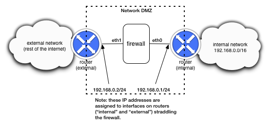

# Lab 7: Firewall

## To be replaced


Lab-7 is going to be replaced by a new lab.


## ~~Overview~~

~~The goal for this project is to create firewall that inspects and possibly changes packet contents for packet traffic entering and exiting a network. The firewall rules we will use will be simple static rules \(i.e., no "stateful" or dynamic rules\), with one twist: we'll add the option to rate-limit certain packet flows using the token bucket algorithm.~~

~~The firewall can either be created as an extension of the IPv4 router project, or as a separate device that _silently_ inspects and possibly blocks traffic. The silent version of the firewall is described below. To integrate the firewall with the router, you would need to apply firewall rules \(described below\) after receiving a packet and before any forwarding decision is made. Again, the description below assumes a standalone device, but the differences between this and integrating with the router are quite minor.~~

~~Below is a picture of the example network topology that is implied by the tests, and that is created by the Mininet script supplied with this project. The firewall for which you will be writing the logic is positioned at the exterior of a network to be protected \("internal network"\), inside what is often referred to as the network DMZ. The firewall has just two interfaces, and is connected such that it will "see" all traffic sent from the internal network out to the rest of the internet, and it will also see any traffic coming from the rest of the internet back to the internal network.~~



~~Notice that there are only two interfaces assigned to the firewall device. The basic behavior of your device is to simply forward packets from one interface to the other. You do not need to any routing logic or anything like that. The firewall logic \(described below\) should be applied after receiving a packet on one interface and before sending it out the other interface. It is ok in this project to assume that you will only ever have 2 network interfaces on the firewall device.~~

## Your Tasks

There are three things to accomplish for this project:

1. Implement firewalling logic based on a simple set of rules that are

   stored in a text file.

2. Implement a rate-limiting capability so that certain packet flows

   are given limited network bandwidth.

3. Implement a network impairment of your choice, designed to disrupt

   certain packet flows.

Details for each of these items are given below.


The sentences marked with ✅ are related to the content of your report. Please pay attention.


### Task 1: Preparation

Initiate your project with our template.

[Start the task here](preparation.md)

### Task 2: Implement firewall rules

Implement firewall rules.

[Start the task here](firewall-rules.md)

### Task 3: Implement the token bucket algorithm

Implement the token bucket algorithm.

[Start the task here](token-bucket.md)

### Task 4: Implement some other type of network impairment

Implement some other type of network impairment.

[Start the task here](impairment.md)

### Task 5: Testing

Make sure that your firewall function correctly.

[Start the task here](testing.md)

## Handing it in

### Report

We will provide a template of your lab assignment report [here](https://box.nju.edu.cn/d/123a70ac8ff34595b18f/). You need to submit the report in your repository named `<学号><姓名>_lab_7`. The format of your report can be Microsoft Doc or PDF. An example is `123456789拾佰仟_lab_7.pdf`.

### Submit to NJU GitLab

To submit your work, you need to do the following things.

1. Modify your code and complete your report.
2. When you have done your work, put your report and code in the folder `lab_7` then commit them. Tag the commit named `<学号/lab_7>` which you want to submit. An example is `123456789/lab_7`. Finally your project will look like

   ```text
   switchyard
     ├─docs/
     ├─.../
   + ├─lab_7/
   + │ ├─123456789拾佰仟_lab_7.pdf
   + │ ├─firewall.py
   + │ ├─firewall_rules.txt
   + │ ├─firewalltests.py
   + │ ├─www
   + │ │ ├─start_webserver.sh
     │ ├─...
   + │ └─start_mininet.py
     ├─.gitignore
     └─...
   ```

   The file names in your submission have to **exactly** match the file names above. Otherwise, you will lose points!

3. Submit your work by pushing your local repository to your remote repository **with your tags** by running the command `git push origin --tags`.

   **Only** commit your **source code** to your local repository. If there are some generated files that are not source code, ignore them by adding them in the file `.gitignore`.

